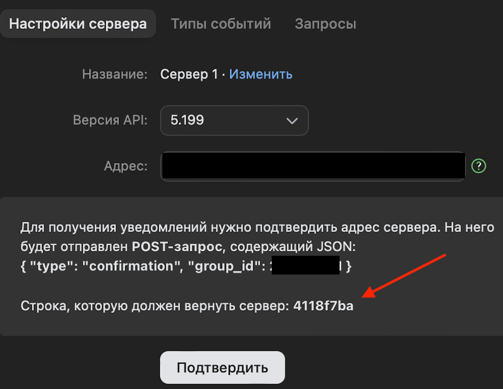
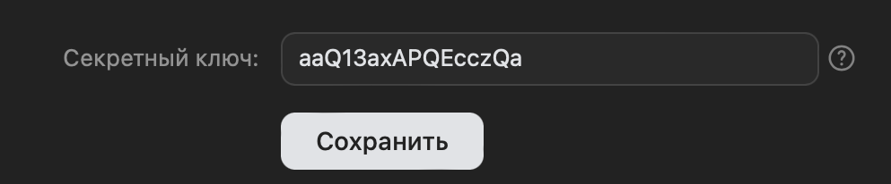

# Vk echo bot

Vk echo bot using Callback API

### How to use

Create your [community](https://dev.vk.com/ru/api/callback/getting-started) and set up callback API, with next params:
* API version - 5.199
* Address - your ngrok address on application port (default 8080) + /vkbot path.
Example: https://95ae-37-5-22-33.ngrok-free.app/vkbot
* Go to event type tab and set only incoming messages checkbox 

For starting application you need to get 5 variables: 

* [vk api key](https://dev.vk.com/ru/api/access-token/getting-started#Ключ%20доступа%20сообщества) - for call vk api 
method. the key must have access rights to community messages. Env VK_API_KEY
* [vk group id](https://dev.vk.com/ru/api/bots/getting-started) - create your community and copy its ID. 
Env VK_GROUP_ID
* vk confirmation string. Env VK_CONFIRMATION_STRING 
* vk api version. 5.199 Env VK_API_VERSION
* vk secret. Env VK_SECRET 

### Additional Links

These additional references should also help you:

* [Ngrok](https://ngrok.com) - for https url

